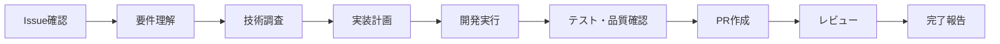

# 🎓 開発者向けレクチャガイド - Vibey Technologies

**対象**: 開発者・エンジニア・AI開発メンバー  
**目的**: GitHub Issues駆動開発の習得とチームワークフロー理解  
**レベル**: 初級〜上級  
**作成日**: 2025年8月3日

---

## 📋 目次

1. [開発フロー概要](#-開発フロー概要)
2. [GitHub Issues の読み方・解釈](#-github-issues-の読み方解釈)
3. [役割別開発アプローチ](#-役割別開発アプローチ)
4. [技術実装ガイド](#-技術実装ガイド)
5. [品質・テスト基準](#-品質テスト基準)
6. [チーム連携・コミュニケーション](#-チーム連携コミュニケーション)
7. [実践演習](#-実践演習)

---

## 🚀 開発フロー概要

### 基本フロー: GitHub Issues → 開発 → 完了報告



### 重要な心構え
1. **Issue = 開発指示書**: 全ての情報がIssueに記載されている
2. **品質第一**: 動くだけでなく、高品質なコードを書く
3. **チーム連携**: 一人で悩まず、適切なメンバーに相談
4. **継続改善**: 完了後も改善点を共有・学習

---

## 📖 GitHub Issues の読み方・解釈

### Issue構造の理解

#### 1. **タイトル**: 何をするかの要約
```
[FEATURE] HENKAKU Archive リアルタイム動的データ取得システム
│        │
│        └── 具体的な機能名
└── 種別 (FEATURE/BUG/TASK/SECURITY/QUALITY)
```

#### 2. **ラベル**: 開発の重要情報
```
type/feature          → 新機能開発
priority/high         → 高優先度（72時間以内対応）
project/henkaku-ai-archive → 対象プロジェクト
area/api             → 技術領域
automation/ai-task   → AI支援対象
```

#### 3. **本文セクション**: 開発に必要な全情報

### 📋 Issue読解チェックリスト

開発開始前に必ず確認：

#### ✅ 要件理解チェック
- [ ] **何を作るか**: 機能概要・背景を理解した
- [ ] **なぜ作るか**: 目的・改善目標を理解した  
- [ ] **誰のためか**: ユーザー・ステークホルダーを理解した
- [ ] **いつまでか**: 期限・マイルストーンを確認した

#### ✅ 技術要件チェック
- [ ] **使用技術**: 指定された技術スタック・フレームワーク
- [ ] **既存システム**: 既存コードとの連携・互換性
- [ ] **パフォーマンス**: 速度・品質の数値目標
- [ ] **セキュリティ**: セキュリティ要件・制約事項

#### ✅ 受け入れ条件チェック
- [ ] **必須機能**: 絶対に実装すべき機能リスト
- [ ] **品質要件**: テストカバレッジ・品質基準
- [ ] **成功基準**: 完了判定の具体的指標

### 🤔 不明点の解決方法

#### Level 1: Issue内で情報収集
```markdown
Issue本文・コメント・関連リンクを詳細確認
↓
既存コード・ドキュメントを調査
↓  
類似Issue・過去事例を検索
```

#### Level 2: チームメンバーに相談
```markdown
技術的疑問 → @FullStack-Kai or @FullStack-Noa
品質・テスト → @QA-Mira  
セキュリティ → @Security-Zane
UI/UX → @UI-Luna
インフラ → @DevOps-Rex
全体調整 → @PM-Aiden
```

#### Level 3: sparkさんに確認
```markdown
要件・仕様の根本的疑問
ビジネス・戦略的判断が必要
緊急・重要な決定事項
```

---

## 👥 役割別開発アプローチ

## 🧑‍💻 FullStack-Kai (フルスタック開発リーダー)

### 担当Issue特徴
- `type/feature` - 新機能開発
- `type/epic` - 大規模プロジェクト
- 技術リーダーシップが必要な案件

### 開発アプローチ
```markdown
1. 技術調査・アーキテクチャ設計
   - 最適な技術スタック選定
   - フロント・バック統合設計
   - スケーラビリティ・保守性考慮

2. 実装計画策定
   - Phase分割・優先順位決定
   - 他メンバーとの作業分担
   - リスク・ボトルネック特定

3. コード実装
   - クリーンコード・ベストプラクティス遵守
   - テスト駆動開発（TDD）
   - ユーザー体験重視

4. チーム指導・レビュー
   - 他メンバーへの技術支援
   - コードレビュー・品質向上提案
   - 知識共有・ドキュメント作成
```

### 実装例: HENKAKU Archive動的データ取得
```typescript
// 1. まず全体設計を考える
interface HenkakuArchiveSystem {
  dataSource: AirtableAPI;
  cache: CacheStrategy;
  ui: DynamicTileGrid;
  performance: OptimizationStrategy;
}

// 2. フルスタック視点で実装
// Backend: API Route
export async function GET() {
  const cacheKey = 'henkaku-data';
  const cachedData = await redis.get(cacheKey);
  
  if (cachedData) return Response.json(cachedData);
  
  const freshData = await fetchFromAirtable();
  await redis.setex(cacheKey, 300, freshData); // 5分キャッシュ
  
  return Response.json(freshData);
}

// Frontend: React Component  
export default function HenkakuArchive() {
  const { data, loading, error } = useSWR('/api/henkaku-data');
  
  if (loading) return <SkeletonGrid />;
  if (error) return <ErrorFallback />;
  
  return <DynamicTileGrid data={data} />;
}
```

## 👩‍💻 FullStack-Noa (フルスタック開発専門)

### 担当Issue特徴
- `type/task` - 堅実な実装が必要
- データベース・API関連
- パフォーマンス・スケーラビリティ重視

### 開発アプローチ
```markdown
1. 堅実な設計・実装
   - データモデル・API仕様の詳細設計
   - エラーハンドリング・例外処理
   - 長期運用を見据えた実装

2. パフォーマンス最適化
   - データベース・クエリ最適化
   - API応答時間改善
   - メモリ・CPU使用量最適化

3. セキュリティ・品質重視
   - 入力値検証・データサニタイゼーション
   - 認証・認可・暗号化適切実装
   - 堅牢なエラーハンドリング

4. 監視・運用考慮
   - ログ・メトリクス設計
   - 障害対応・復旧手順
   - スケーリング戦略
```

### 実装例: セキュアなAirtable API統合
```typescript
// 堅実なAPI実装例
import { z } from 'zod';
import rateLimit from 'express-rate-limit';

// バリデーションスキーマ定義
const AirtableResponseSchema = z.object({
  records: z.array(z.object({
    id: z.string(),
    fields: z.object({
      Title: z.string().min(1).max(100),
      Description: z.string().optional(),
      Category: z.enum(['Research', 'Tools', 'Community']),
      Published: z.boolean().default(false)
    })
  }))
});

// Rate Limiting
const limiter = rateLimit({
  windowMs: 15 * 60 * 1000, // 15 minutes
  max: 100 // limit each IP to 100 requests per windowMs
});

export async function GET(request: Request) {
  try {
    // 1. 認証確認
    const apiKey = process.env.AIRTABLE_API_KEY;
    if (!apiKey) {
      throw new Error('Airtable API key not configured');
    }

    // 2. データ取得（リトライ機能付き）
    const data = await fetchWithRetry(apiKey, 3);
    
    // 3. データ検証
    const validatedData = AirtableResponseSchema.parse(data);
    
    // 4. データ変換・サニタイゼーション
    const sanitizedData = validatedData.records
      .filter(record => record.fields.Published)
      .map(record => ({
        id: record.id,
        title: sanitizeHtml(record.fields.Title),
        description: sanitizeHtml(record.fields.Description || ''),
        category: record.fields.Category
      }));

    // 5. レスポンス返却
    return Response.json(sanitizedData, {
      headers: {
        'Cache-Control': 'public, max-age=300', // 5分キャッシュ
        'Content-Type': 'application/json'
      }
    });

  } catch (error) {
    console.error('Airtable API Error:', error);
    
    // フォールバック データ返却
    const fallbackData = await getFallbackData();
    return Response.json(fallbackData, { status: 206 });
  }
}

async function fetchWithRetry(apiKey: string, maxRetries: number) {
  for (let i = 0; i < maxRetries; i++) {
    try {
      const response = await fetch(AIRTABLE_URL, {
        headers: { 'Authorization': `Bearer ${apiKey}` }
      });
      
      if (!response.ok) {
        throw new Error(`HTTP ${response.status}`);
      }
      
      return await response.json();
    } catch (error) {
      if (i === maxRetries - 1) throw error;
      await new Promise(resolve => setTimeout(resolve, 1000 * (i + 1))); // 指数バックオフ
    }
  }
}
```

---

## 🧪 品質・テスト基準

### 必須テスト項目

#### 単体テスト (85%以上カバレッジ)
```typescript
// 例: Airtable API関数のテスト
describe('Airtable API', () => {
  test('正常なデータ取得', async () => {
    const mockData = { records: [{ id: '1', fields: { Title: 'Test' } }] };
    global.fetch = jest.fn().mockResolvedValue({
      ok: true,
      json: () => Promise.resolve(mockData)
    });

    const result = await fetchFromAirtable();
    expect(result).toEqual(mockData);
  });

  test('API エラー時のフォールバック', async () => {
    global.fetch = jest.fn().mockRejectedValue(new Error('API Error'));
    
    const result = await fetchFromAirtable();
    expect(result).toEqual(getFallbackData());
  });
});
```

#### 統合テスト
```typescript
// 例: API → UI データフローテスト
test('API からUI表示まで', async () => {
  render(<HenkakuArchive />);
  
  // ローディング表示確認
  expect(screen.getByText('Loading...')).toBeInTheDocument();
  
  // データ取得後の表示確認
  await waitFor(() => {
    expect(screen.getByText('Test Title')).toBeInTheDocument();
  });
});
```

#### E2Eテスト (Playwright/Cypress)
```typescript
// 例: 完全なユーザーフローテスト
test('HENKAKU Archive ページ表示', async ({ page }) => {
  await page.goto('/henkaku-archive');
  
  // 初回読み込み
  await expect(page.locator('.loading-skeleton')).toBeVisible();
  
  // データ表示確認
  await expect(page.locator('.tile-grid')).toBeVisible();
  await expect(page.locator('.tile-item')).toHaveCount(10);
  
  // レスポンシブ確認
  await page.setViewportSize({ width: 375, height: 667 });
  await expect(page.locator('.tile-grid')).toHaveClass(/mobile-layout/);
});
```

### パフォーマンス基準
```typescript
// Lighthouse スコア自動テスト
test('Performance metrics', async () => {
  const result = await lighthouse(url, {
    onlyCategories: ['performance', 'accessibility', 'seo']
  });
  
  expect(result.lhr.categories.performance.score).toBeGreaterThan(0.9);
  expect(result.lhr.categories.accessibility.score).toBeGreaterThan(0.9);
  expect(result.lhr.categories.seo.score).toBeGreaterThan(0.9);
});
```

---

## 🤝 チーム連携・コミュニケーション

### Issue内でのコミュニケーション

#### 進捗報告テンプレート
```markdown
## 進捗更新 - 2025/8/3 14:30

### 完了項目
- [x] Airtable API統合基本実装完了
- [x] データ変換ロジック実装・テスト完了

### 進行中項目  
- [ ] UI コンポーネント実装中（70%完了予定）
- [ ] レスポンシブ対応検討中

### 次のアクション
- @UI-Luna デザイン仕様の確認お願いします
- @QA-Mira テストケース追加が必要です

### ブロッカー・懸念
特になし（順調に進行中）

### 見積もり更新
残り工数: 8時間 | 完了予定: 2025/8/5
```

#### 技術相談テンプレート
```markdown
## 技術相談 - パフォーマンス最適化について

### 現状
Airtable API の応答時間が平均1.2秒で、目標の500ms以下を超過

### 検討案
1. **キャッシュ戦略**: Redis で5分間キャッシュ
2. **ISR実装**: Next.js Incremental Static Regeneration  
3. **CDN活用**: Cloudflare でエッジキャッシュ

### 相談内容
@DevOps-Rex インフラコスト・運用負荷の観点からご意見お願いします
@Security-Zane キャッシュ戦略のセキュリティリスク確認お願いします

### 判断期限
2025/8/4 午前中に決定したいです
```

### 他メンバーとの連携方法

#### QA-Mira との連携
```markdown
実装完了時のやり取り:

開発者 → QA-Mira
「@QA-Mira 実装完了しました。以下の観点でテストお願いします：
- API エラー時のフォールバック動作
- レスポンシブ表示（Mobile/Tablet/PC）
- パフォーマンス（初回表示2秒以内）」

QA-Mira → 開発者  
「テスト実行しました。以下の課題が見つかりました：
- Mobile表示でタイルレイアウトが崩れています
- API タイムアウト時のエラーメッセージが不適切
- 修正をお願いします」
```

#### Security-Zane との連携
```markdown
セキュリティレビュー依頼:

開発者 → Security-Zane
「@Security-Zane セキュリティレビューお願いします
- Airtable API キー管理
- ユーザー入力の サニタイゼーション  
- CORS設定
コード: https://github.com/repo/pull/123」

Security-Zane → 開発者
「⚠️ 以下のセキュリティ課題を発見しました：
- API キーがクライアントサイドに露出しています
- XSS対策が不十分です  
- 修正版のコード例を提示しました」
```

---

## 💡 実践演習

### 演習1: Issue解釈練習

以下のIssueを読んで、開発アプローチを考えてください：

```markdown
[BUG] HENKAKU Archive モバイル表示でタイルが重なる問題

## 現象
iPhone 12 Safari で HENKAKU Archive を表示すると、タイルが重なって表示される

## 再現手順
1. iPhone 12 (375px width) で https://henkaku-archive.com にアクセス
2. 縦スクロールすると、3番目以降のタイルが重なって表示される

## 期待動作
タイルが適切な間隔で縦に配置される

## 環境
- デバイス: iPhone 12
- ブラウザ: Safari 16.5
- 画面サイズ: 375px × 667px

優先度: High | 期限: 2025/8/4
```

#### 考えるべきポイント
1. この問題の原因は何か？
2. 修正方法は？
3. 同様の問題を防ぐには？
4. どんなテストが必要か？

### 演習2: 実装計画策定

HENKAKU Archive リアルタイム動的データ取得の実装計画を立ててください：

#### 与えられた情報
- Next.js App Router使用
- Airtable API連携必須
- パフォーマンス: 2秒以内
- レスポンシブ対応必須

#### 作成すべき計画
1. **Phase分割**: どの順番で実装するか
2. **技術選択**: どの技術・ライブラリを使うか  
3. **リスク対策**: 何が問題になりそうか
4. **テスト戦略**: どうやって品質を保証するか

### 演習3: コードレビュー練習

以下のコードをレビューしてください：

```typescript
// Airtable データ取得関数
async function getData() {
  const res = await fetch('https://api.airtable.com/v0/app123/Table%201', {
    headers: {
      'Authorization': 'Bearer keyABC123' // ← 問題1
    }
  });
  
  const data = await res.json(); // ← 問題2
  return data.records; // ← 問題3
}

// React コンポーネント
export default function Archive() {
  const [data, setData] = useState([]);
  
  useEffect(() => {
    getData().then(setData); // ← 問題4
  }, []);
  
  return (
    <div>
      {data.map(item => ( // ← 問題5
        <div>{item.fields.Title}</div>
      ))}
    </div>
  );
}
```

#### 見つけるべき問題点
1. セキュリティ問題
2. エラーハンドリング不足  
3. データ検証不足
4. パフォーマンス問題
5. アクセシビリティ問題

---

## 🎯 成功する開発者の特徴

### ✅ Good Developer の行動パターン

1. **Issue を徹底的に読む**
   - 背景・目的・制約を完全理解
   - 不明点は即座に質問・確認
   - 既存コード・関連資料を事前調査

2. **計画 → 実装 → 検証のサイクル**
   - 実装前に必ず設計・計画を立てる
   - 小さな単位で実装・テスト・確認
   - 早期に他メンバーとの連携・相談

3. **品質を妥協しない**
   - テストを必ず書く（TDD推奨）
   - セキュリティ・パフォーマンスを常に意識
   - コードレビューを積極的に活用

4. **チームプレイヤー**
   - 進捗・課題を適切にコミュニケーション
   - 他メンバーの専門性を尊重・活用
   - 知識・経験を積極的に共有

### ❌ 避けるべき行動パターン

1. **Issue を読まずに実装開始**
   - 要件誤解による手戻り発生
   - 品質・パフォーマンス要件無視
   - 期限・優先度の認識不足

2. **一人で抱え込む**
   - 長時間の悩み・迷い
   - 専門外への無理な挑戦
   - チームメンバーへの相談不足

3. **テスト・品質を軽視**
   - 動けばOKの考え方
   - 本番での障害・問題発生
   - 長期保守性の欠如

---

## 📚 参考資料・学習リソース

### 必読ドキュメント
- [TEAM_STRUCTURE_OVERVIEW.md](./TEAM_STRUCTURE_OVERVIEW.md) - チーム体制理解
- [GITHUB_ISSUE_MANAGEMENT_GUIDE.md](./GITHUB_ISSUE_MANAGEMENT_GUIDE.md) - Issue管理方法
- [CODE_QUALITY_CHECKLIST.md](./CODE_QUALITY_CHECKLIST.md) - 品質基準
- [UNIFIED_DEVELOPMENT_STANDARDS.md](./UNIFIED_DEVELOPMENT_STANDARDS.md) - 開発標準

### 技術学習リソース
- **Next.js**: [Next.js App Router](https://nextjs.org/docs/app)
- **TypeScript**: [TypeScript Handbook](https://www.typescriptlang.org/docs/)
- **Testing**: [Jest](https://jestjs.io/docs/getting-started), [React Testing Library](https://testing-library.com/docs/react-testing-library/intro/)
- **API**: [Airtable API](https://airtable.com/developers/web/api/introduction)

### 品質・セキュリティ
- **OWASP**: [OWASP Top 10](https://owasp.org/www-project-top-ten/)
- **Accessibility**: [WCAG Guidelines](https://www.w3.org/WAI/WCAG21/quickref/)
- **Performance**: [Web Vitals](https://web.dev/vitals/)

---

## 🚀 次のステップ

### 新人開発者の学習パス
```
Week 1: Issue読解・基本開発フロー習得
Week 2: 小規模Issue（type/task）で実践
Week 3: 中規模Issue（type/feature）に挑戦  
Week 4: チーム連携・レビュー技術向上
```

### 経験者の即戦力化
```
Day 1: Vibey Technologies開発ルール・基準理解
Day 2: 既存コード・アーキテクチャ理解
Day 3: 実際のIssue担当・実装開始
Day 4+: フルスピード開発・チーム貢献
```

### 継続的成長
- 毎週の振り返り・改善活動
- 新技術・手法の継続学習
- チームメンバーとの知識共有
- オープンソース・コミュニティ貢献

---

**このレクチャガイドを習得すれば、Vibey Technologiesの開発チームで即戦力として活躍できます！**

質問・不明点があれば、いつでもPM-Aidenまでお気軽にご相談ください 🚀

---

*作成者: PM-Aiden | 対象: 全開発者 | 最終更新: 2025年8月3日*